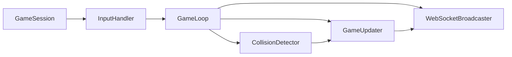

# 貪食蛇 Spring Boot 後端分析與規劃

## 1. Domain Model 與狀態欄位
- `GameSession`
  - `String sessionId`：對應房間或 `WebSocket` `roomId`
  - `GameStatus status`（`WAITING`, `RUNNING`, `ENDED`）
  - `long currentTick`
  - `int gridWidth`, `int gridHeight`
  - `Snake snake`
  - `Food food`
  - `Map<String, Object> metadata`（可擴充心跳、協調、統計）
- `Snake`
  - `String playerId`
  - `Deque<Cell> body`：蛇頭在 `body.peekLast()`，其餘節點從頭到尾
  - `Direction currentDirection`
  - `Direction pendingDirection`：下一個合法方向，由輸入緩衝並在 `GameLoop` tick 前驗證
  - `boolean alive`
  - `int score`
  - `Instant lastMoveTime`
- `Food`
  - `Cell location`
  - `FoodType type`（預留特殊食材）
  - `int value`
- `Cell`
  - `int x`, `int y`
  - `Cell add(Direction direction)`：輔助計算新頭位置

## 2. 模組協作與 Tick 推進
1. **InputHandler**（可為 `@Service`）：
   - 接收 `move` 指令，驗證不與 `Snake.currentDirection` 反向（遵循 [`development-guidelines.md`](development-guidelines.md:35-49) 的合法方向規範），並將合法方向寫入 `pendingDirection`
   - 非法輸入回傳 `input_error`（包含原因、timestamp）並記錄 `moveAckId`
2. **GameLoop**（定時排程或 `ScheduledExecutor`）：
   - 每 `tickInterval` 觸發一次，按照 `GameSession.currentTick` 依序執行：
     - 從 `Snake.pendingDirection` 更新 `currentDirection`（若 `pendingDirection` 為 `null`，則持續原方向）
     - 計算新頭位置 `Cell nextHead = snake.body.peekLast().add(currentDirection)`
     - 呼叫 `CollisionDetector` 判斷是否撞牆/自己
     - 若存活，呼叫 `GameUpdater` 處理食物、成長、分數與 `food` 重置
     - 呼叫 `WebSocketBroadcaster` 依事件發送 `game_state_update` 等
     - 將每個合法輸入對應的 `move_ack` 回應給來源 client
3. **CollisionDetector**
   - 根據 `nextHead` 判斷是否超出 `grid` 或 `Snake.body`（可透過 `Set<Cell>` 快速查詢）
   - 若撞擊，設定 `Snake.alive = false` 與 `deathReason`，並返回 `CollisionResult.DEAD`
4. **GameUpdater**\n   - 若未撞擊：
     - 若 `nextHead.equals(food.location)`，則加入 `body.addLast(nextHead)`（成長）並 `score += food.value`
     - 否則先 `body.addLast(nextHead)` 再 `body.pollFirst()`（保持長度）
     - 若食物被吃掉，重新 `spawnFood()` 保持與 `Snake.body` 不重疊
   - 返回 `UpdateResult`（例如 `GROWTH`, `MOVE_ONLY`）以供事件廣播
5. **WebSocketBroadcaster**
   - `game_state_update`：每個 tick 給 `/topic/game/{sessionId}` 推送包含 `tick`, `snake`, `food`, `status`
   - `growth_event`：當 `UpdateResult` 為 `GROWTH` 時額外廣播，附帶 `addedSegment`, `newScore`
   - `death_event`：當 `Snake.alive` 變 `false`，廣播 `reason`, `finalScore`
   - `move_ack`：對每個 `move` 指令回應狀態（`accepted`, `rejected`, `ignored`）及 `tick`
   - `input_error`：回傳非法方向或頻率太高的錯誤，包含 `errorCode`, `message`

## 3. Snake 狀態追蹤與輸入策略
- `alive`：由 `CollisionDetector` 設定；一旦 `false`，`GameLoop` 跳過後續 `GameUpdater` 與 `pendingDirection` 更新，並向 client 發送 `death_event`
- `score`：由 `GameUpdater` 增加，並同步進 `game_state_update`
- `nextDirection`（暫存於 `pendingDirection`）：
  - 只在 `InputHandler` 發現合法方向時更新
  - `GameLoop` tick 開始時再寫回 `currentDirection`
  - `pendingDirection` 需有限頻策略（例如來自同一 `session` 的 100ms 間隔）來收斂使用者大量 keydown 事件
  - 當 `pendingDirection` 為反方向時回傳 `input_error`，但不覆蓋上一個合法指令
- 防止反方向：在 `InputHandler` 比對 `currentDirection`，在 `GameLoop` tick 前持續鎖定，避免快取 stale 指令
- 輸入收斂：可維護 `Deque<Direction>` 僅保留最新一次合法方向，或強制只接受來自 `sessionId` 的最新 `move`，多餘的丟棄並回傳 `move_ack` 狀態 `ignored`

## 4. 可視化模組互動流程

**說明**：每個 `tick` 由 `GameLoop` 取 `pendingDirection` 做 `CollisionDetector` 判斷，若仍存活則交由 `GameUpdater` 處理移動，最後 `WebSocketBroadcaster` 發送事件；`InputHandler` 可隨時更新 `pendingDirection` 並接收 `move_ack`/`input_error`。本階段僅完成分析與規劃，不會進行實作。
